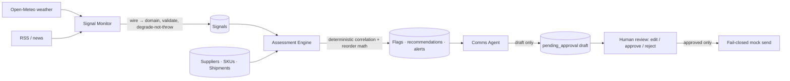

# Supply Watch

Supply-chain disruption monitoring that turns external signals into deterministic reorder decisions, then drafts supplier communications behind a human approval gate.

This is a scheduled, stateful operations system-not an LLM deciding what to buy. The inventory decision path is deterministic TypeScript; language models are optional, capped drafting and narration helpers.

## What it does

On each tick, the system normalizes weather and RSS/news signals, correlates them with synthetic suppliers, SKUs, and in-transit shipments, applies disruption lead-time effects, and computes reorder recommendations. An actionable result creates a risk flag and dashboard alert. Supplier communications are drafts only: a human can edit, approve, reject, and then trigger the mock send path.

The dashboard is intentionally an honest demo surface. `Inject synthetic disruption` is visibly labeled `Demo · replay` and only creates synthetic data.



## Architecture and safety boundaries

| Stage             | Responsibility                                                                            | LLM role                                                             |
| ----------------- | ----------------------------------------------------------------------------------------- | -------------------------------------------------------------------- |
| Signal Monitor    | Weather and RSS/news adapters, normalization, dedupe, signal lifecycle                    | Optional news extraction only; deterministic fallback is the default |
| Assessment Engine | Region/route correlation, shipment exposure, reorder math, flags, recommendations, alerts | **None.** Every decision is deterministic                            |
| Comms Agent       | Supplier subject/body/tone drafts                                                         | Optional, capped drafting only; persists `pending_approval`          |
| Approval and send | Human edit/approve/reject; mock transport by default                                      | None; send re-reads approval server-side                             |

Important implementation boundaries:

- Provider wire shapes are validated and mapped to domain objects at the adapter boundary; business code does not consume raw provider payloads.
- Missing or malformed signal data becomes `degraded` and is excluded from correlation. Missing inventory inputs yield `insufficient_data`, never fabricated numbers.
- The tick uses a Postgres advisory lock; dedupe, risk-flag, recommendation, draft, and alert keys make re-runs idempotent.
- Time is injected through `RunContext.clock`. Frozen-clock replays are deterministic.
- Shipment-route exposure excludes delayed in-transit quantity from effective on-order inventory when it will miss the protected lead-time window.
- Sending is fail-closed: `sendDraft` re-checks both `approved` status and a matching approval record at send time. A browser cannot mark a draft sent.

## Deterministic inventory decision

The reorder engine computes safety stock, reorder point, EOQ, inventory position, and MOQ-rounded recommendation quantities. It follows an integer rounding contract so replay fixtures can assert exact values. Disruption affects lead time and, for exposed routes, can remove a delayed shipment from effective on-order inventory. The LLM has no quantity, risk, timing, or reorder field to author.

## Evidence, not vanity metrics

| Evidence                        | Current repository proof                                                                                           |
| ------------------------------- | ------------------------------------------------------------------------------------------------------------------ |
| Deterministic numeric exactness | Hand-computed frozen-clock replay fixtures assert exact integer safety stock, ROP, and recommended quantity values |
| Shipment-level coverage         | A dedicated `shipment_route` replay verifies delayed on-order exclusion and a shipment-level flag                  |
| Fail-closed sending             | Replay assertions require zero sends without approval; send code re-checks approval at the server boundary         |
| Degrade-not-crash               | Garbage/partial signal coverage persists `degraded` and creates no decision                                        |
| Sabotage verification           | The formula canary deliberately perturbs the ROP result and must be caught by the eval assertions                  |
| Test layers                     | 109 offline tests plus two live-DB integration tests against the isolated `eval` schema                            |

Scenario pass rate is intentionally **not** a headline metric: self-authored scenarios can trivially pass. The useful evidence is numeric exactness, no-unapproved-send behavior, degradation handling, and the canary proving the evaluation binds to the formula.

## Cost discipline

There are three optional LLM surfaces: RSS/news extraction, assessment narration, and supplier comms drafting. All are off by default, environment-routed to inexpensive models, bounded per tick, and have deterministic fallbacks where applicable. Weather never uses an LLM, and the Assessment Engine never does.

The build and automated validation runs spend **$0** on LLM calls: tests use fixtures/stubs, and the synthetic dashboard draft is a labeled template. Real multi-item LLM work is intentionally not part of ordinary CI.

## Why this is different from Project 1

| Dimension            | Project 1: PriorAuth Copilot             | This project: Supply Watch                                          |
| -------------------- | ---------------------------------------- | ------------------------------------------------------------------- |
| Execution model      | User request → response Q&A              | Scheduled/background ticks and dashboard state                      |
| Inputs               | Static payer documents                   | Flaky weather and RSS/news sources                                  |
| Decision core        | Retrieval-assisted authorization support | Closed-form, deterministic inventory math                           |
| Evaluation           | Golden Q&A cases                         | Frozen-clock disruption replay and formula canary                   |
| Human role           | Reads an answer                          | Approves/edits/rejects a supplier communication before send         |
| Operational behavior | Per-request                              | Event-driven flags, alerts, persisted lifecycle, idempotent re-runs |

## Stack

- Next.js 15, React 19, TypeScript strict mode
- Supabase Postgres with relational tables and a separate `eval` schema
- Zod validation at wire/domain boundaries
- Open-Meteo weather adapter and RSS/news adapter
- Vitest for unit, replay, and live-DB integration coverage
- Optional OpenAI/Anthropic adapter surfaces with environment-routed models

## Setup

Prerequisites: Node 22+, pnpm, and a linked Supabase project.

```bash
pnpm install
cp .env.example .env
# Fill in the required Supabase values and TICK_SECRET.

pnpm db:push
pnpm db:seed
pnpm seed:demo
pnpm dev
```

Open `http://localhost:3000`; the root route redirects to `/dashboard`.

`seed:demo` and the dashboard's `Inject synthetic disruption` control share one routine. It clears prior synthetic demo state, inserts a fresh labeled weather/news scenario, runs the real public assessment pipeline, and creates a synthetic template draft when actionable work exists.

## Environment

Required values are documented in [.env.example](.env.example). The core required settings are:

```text
SUPABASE_URL
SUPABASE_ANON_KEY
SUPABASE_SERVICE_ROLE_KEY
TICK_SECRET
```

Useful optional settings include `APPROVER_NAME`, `ENABLE_LLM_NEWS`, `ENABLE_LLM_NARRATION`, `ENABLE_LLM_COMMS`, `MAX_*_PER_TICK`, `ENABLE_REAL_SEND`, provider API keys, and provider timeout/retry settings. Keep `.env` local; never commit it.

## Commands

```bash
pnpm dev                 # Next development server
pnpm build               # Production build
pnpm typecheck           # TypeScript strict check
pnpm lint                # ESLint
pnpm format:check        # Prettier check
pnpm test:run            # Fast offline suite; no live database
pnpm test:integration    # dotenv-backed live-DB integration suite
pnpm evals:report        # Replay/eval summary
pnpm db:seed             # Synthetic supplier/SKU/shipment inventory
pnpm seed:demo           # Fresh synthetic dashboard cascade
```

The live integration suite uses only the dedicated `eval` schema and calls `eval.reset_all()` before/after the replay; it does not write to `public` production/demo rows.

## Non-goals and deliberate tradeoffs

- No RAG, embeddings, vector database, or pgvector.
- No PostGIS: the synthetic dataset is tiny and region/route set intersections are deterministic, readable, and fast.
- No HITL learning loop: it would add cost, implicit retrieval behavior, and replay nondeterminism without helping the core workflow.
- RSS is an intentionally replaceable adapter. A production deployment can swap in project44 or Everstream without changing the domain/assessment boundary.
- No real email transport by default. Sends are mock/logged unless explicitly environment-enabled.
- No queues, Kafka, Redis, Docker, long-lived workers, or forecasting ML. This is a short-lived tick with relational state and closed-form inventory logic.

## Production deployment

| Surface      | Detail                                                                                                                                                        |
| ------------ | ------------------------------------------------------------------------------------------------------------------------------------------------------------- |
| App          | Vercel project `supply-watch`, auto-deploys from `master`                                                                                                     |
| Public alias | https://supply-watch-console.vercel.app                                                                                                                       |
| Cron alias   | https://supply-watch-abhi-soraris-projects.vercel.app (leave cron pointed here)                                                                               |
| Hourly tick  | Supabase `pg_cron` job `supply_watch_hourly_tick` (`0 * * * *`) POSTs `/api/tick/run` on the cron alias with `Authorization: Bearer <TICK_SECRET>` from Vault |
| Database     | Supabase Postgres (`public` + `eval`); schema via `supabase/migrations`                                                                                       |

CI (GitHub Actions) runs typecheck, lint, format, offline tests, build, and gitleaks on every push. `pnpm build` does **not** require secrets - env validation is lazy via `getEnv()`. Runtime still fails closed when required vars are missing.

Configure the cron secret and schedule with `public.configure_hourly_supply_watch_tick(p_tick_secret)` (see migrations `20260714000000` / `20260714000001`). Do not retarget the cron URL away from the cron production alias.

### Refresh the public alias after a production deploy

`supply-watch.vercel.app` is already taken on Vercel. Use `supply-watch-console.vercel.app` instead:

```bash
DEPLOY=$(vercel ls supply-watch --scope abhi-soraris-projects | awk '/● Ready/ && /Production/{print $3; exit}')
vercel alias set "$DEPLOY" supply-watch-console.vercel.app --scope abhi-soraris-projects
curl -sI "https://supply-watch-console.vercel.app/dashboard" | head -1
```

## Demo integrity

Inventory is synthetic and labeled. Simulated injection is visibly marked Simulation mode; it is not presented as live weather/news data. Dashboard sends are mocked by default, and the system remains useful with every LLM feature disabled.
